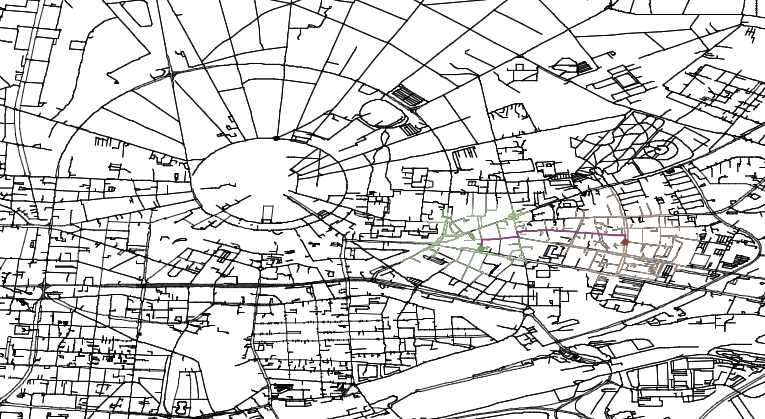

# jbmaps
This is a simple routing application using OpenStreetMap data.
Currently it only uses dijkstras algorithm for routing, but it is planned to further
extend the capabilities with modern routing algorithms, e.g. CHs, CCHs or PHAST.



## Running jbmaps
The project is compiled using `cmake`. It requires a working C++20 setup and a working CMake installation. It also requires `python` and
`turtle` for the visualization. To convert the result to a pdf `epstopdf` is required.
The necessary commands to run and build the project are found in the `justfile`.
To compile the interactive routing application run:

```sh
just config release
just build-release interactive_routing
```
Then run it with:

```sh
just run-release interactive_routing
```

The terminal output should look like this:
```sh
Read in the addresses and create record.....done.
Read the graph data and construct graph.....done.
Construct SSSP Query.....done.
Initialize routing engine.....done.
jbmaps:
```

You can now type in one of the following commands:
- `clear`: Clears the screen.
- `source-address`: Set the source address of the query. You can input valid addresses of the city of karlsruhe. If you supply you own graph data generated using my [osm_to_graph](https://github.com/JohannesBreitling/osm_to_graph) converter, you can use valid addresses from this region.
- `target-address`: Set the target address of the query.
- `show-addresses`: Shows the currently selected addresses for the routing query.
- `route-start`: Computes the shortest path between the source and target. It starts the visualization of the route and the underlying road network. The result of the query is saved in output as a pdf file indicating source, target, shortest path and the search spaces.
